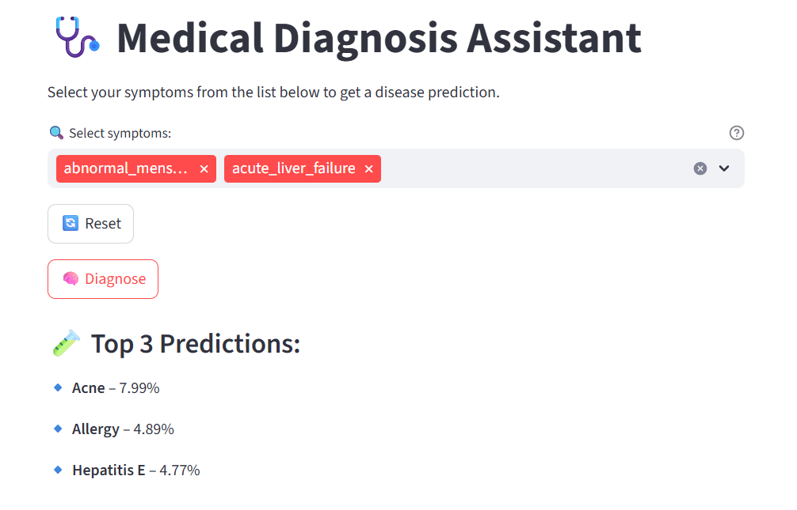
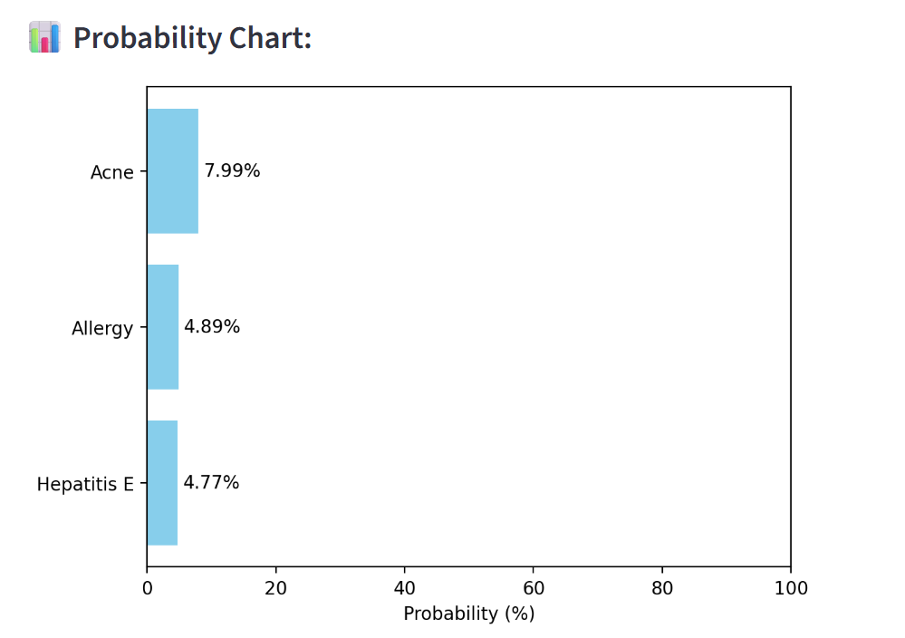

# 🩺 Medical Diagnosis Assistant

A smart, interactive disease prediction system built with **PyTorch** and **Streamlit**.  
Users select symptoms from a list, and the app predicts the most likely disease using a trained neural network.


## 🚀 Features

-  **Symptom Selection**: Choose from a list instead of typing manually  
-  **AI-Based Prediction**: Uses PyTorch to classify 41 diseases based on 17 symptoms  
-  **Top 3 Predictions**: Shows the top 3 possible diseases with confidence scores  
-  **Interactive Probability Chart**: Visual bar chart using `matplotlib`  
-  **Disease Descriptions**: Detailed explanation from medical dataset  
-  **Precaution Suggestions**: Health advice for predicted disease  
-  **One-Click Reset**: Easily clear selections and try again

## 🌐 Live Preview

> Coming soon via Streamlit Cloud or HuggingFace Spaces  
For now, clone and run locally ⬇️

## 📁 Dataset

This app uses the [Disease Symptom Description Dataset on Kaggle](https://www.kaggle.com/datasets/itachi9604/disease-symptom-description-dataset), which includes:

- `dataset.csv`: Symptoms & disease mappings  
- `symptom_description.csv`: Definitions for each disease  
- `symptom_precaution.csv`: Recommended precautions

## 🧠 Technologies Used

| Tool/Library  | Purpose                          |
|---------------|----------------------------------|
| PyTorch       | Deep learning classification     |
| Streamlit     | Web interface                    |
| Pandas        | Data processing                  |
| Matplotlib    | Plotting confidence probabilities|
| scikit-learn  | Encoding disease labels          |

## 💻 How to Run Locally

```bash
# 1. Clone this repository
git clone https://github.com/abdulrahmanhamdi/medical_diagnosis
cd medical_diagnosis

# 2. Create virtual environment
python -m venv venv
.\venv\Scripts\activate  # On Windows

# 3. Install dependencies
pip install -r requirements.txt

# 4. Train the model
python model.py

# 5. Launch the app
streamlit run app.py
```

## 📸 Screenshots

### 🔍 Disease Prediction


### 📊 Confidence Chart


## ✨ Future Enhancements

-  Add natural language chatbot input (e.g. "I have a fever and cough")  
-  Connect to real medical APIs (MedlinePlus, WHO)  
-  Mobile-optimized version  
-  Patient history tracking (login system)

## 🤝 Acknowledgments

Special thanks to the contributors of the original [Kaggle dataset](https://www.kaggle.com/datasets/itachi9604/disease-symptom-description-dataset) and the open-source community.

## 🧾 License

This project is licensed under the MIT License. See `LICENSE` for more info.
